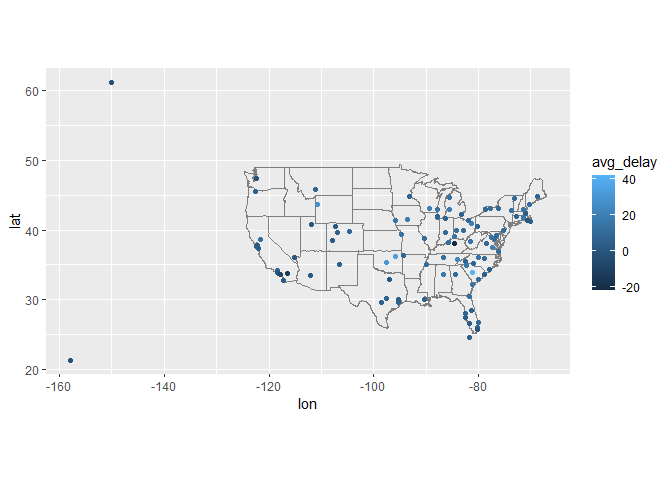
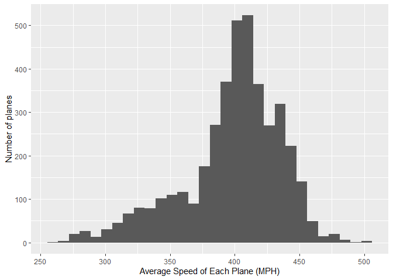

Practice midterm
================
Graham Miotke

## Midterm.

#### 1. Map the delay by destination.

Compute the average delay by destination, then join on the airports data
frame so you can show the spatial distribution of delays. Here’s an easy
way to draw a map of the United States. You are welcome to use this code
or some other code.

``` r
library(tidyverse)
```

    ## -- Attaching packages -------------------------------------------------------------------------------------- tidyverse 1.3.0 --

    ## v ggplot2 3.3.2     v purrr   0.3.4
    ## v tibble  3.0.3     v dplyr   1.0.2
    ## v tidyr   1.1.2     v stringr 1.4.0
    ## v readr   2.0.1     v forcats 0.5.0

    ## Warning: package 'readr' was built under R version 4.0.5

    ## -- Conflicts ----------------------------------------------------------------------------------------- tidyverse_conflicts() --
    ## x dplyr::filter() masks stats::filter()
    ## x dplyr::lag()    masks stats::lag()

``` r
library(nycflights13)
```

    ## Warning: package 'nycflights13' was built under R version 4.0.5

``` r
airports %>%
  semi_join(flights, c("faa" = "dest")) %>%
  ggplot(aes(lon, lat)) +
  borders("state") +
  geom_point() +
  coord_quickmap()
```

<!-- -->

You might want to use the size or colour of the points to display the
average delay for each airport.

``` r
#flights
#planes
#airlines
#airports
#weather

flights%>%
  group_by(dest)%>%
  summarize(avg_delay = mean(arr_delay, na.rm=T))%>%
  left_join(airports, c("dest"="faa")) %>%
  ggplot(aes(lon, lat, col = avg_delay)) +
  borders("state") +
  geom_point() +
  coord_quickmap()
```

    ## `summarise()` ungrouping output (override with `.groups` argument)

    ## Warning: Removed 4 rows containing missing values (geom_point).

<!-- -->

#### 2. Do planes trade ownership?

You might expect that there’s an implicit relationship between plane
and airline, because each plane is flown by a single airline. Explore
this conjecture using data. (Let’s assume that the tail number of a
plane does not change.)

``` r
flights%>%
  group_by(tailnum, carrier)%>%
  summarize(num_of_flights = n())%>%
  group_by(tailnum)%>%
  summarize(num_of_carriers = n())%>%
  filter(num_of_carriers > 1)
```

    ## `summarise()` regrouping output by 'tailnum' (override with `.groups` argument)

    ## `summarise()` ungrouping output (override with `.groups` argument)

    ## # A tibble: 18 x 2
    ##    tailnum num_of_carriers
    ##    <chr>             <int>
    ##  1 N146PQ                2
    ##  2 N153PQ                2
    ##  3 N176PQ                2
    ##  4 N181PQ                2
    ##  5 N197PQ                2
    ##  6 N200PQ                2
    ##  7 N228PQ                2
    ##  8 N232PQ                2
    ##  9 N933AT                2
    ## 10 N935AT                2
    ## 11 N977AT                2
    ## 12 N978AT                2
    ## 13 N979AT                2
    ## 14 N981AT                2
    ## 15 N989AT                2
    ## 16 N990AT                2
    ## 17 N994AT                2
    ## 18 <NA>                  7

There are 17 planes that have flown with different carriers.

#### 3a. Plane’s average speed.

Notice that `flights$air_time` is in minutes. Make a new column that is
the air time in hours.

``` r
flights2 = flights%>%
  mutate(air_time_hour = air_time/60)
```

#### 4b. Average speed

For each flight, compute the average speed of that flight (in miles per
hour). Then, for each plane, compute the average of those average
speeds. Display it in a histogram. You can use a base R histogram `hist`
or ggplot’s `geom_histogram`.

``` r
flights2%>%
  mutate(avg_speed = distance/air_time_hour)%>%
  group_by(tailnum)%>%
  summarize(avg_speed_of_plane = mean(avg_speed, na.rm=T))%>%
  ggplot+geom_histogram(aes(avg_speed_of_plane))+xlab("Average Speed of Each Plane (MPH)")+ylab("Number of planes")
```

    ## `summarise()` ungrouping output (override with `.groups` argument)

    ## `stat_bin()` using `bins = 30`. Pick better value with `binwidth`.

    ## Warning: Removed 7 rows containing non-finite values (stat_bin).

<!-- -->

#### 5. Bonus

Make a table where each row is a destination, each column is a carrier,
and each element is the number of times that the carrier has flown to
that destination. Ensure that you only count flights that arrived at the
destination.

``` r
flights%>%
  filter(!is.na(arr_time))%>%
  group_by(dest, carrier)%>%
  summarize(num_of_flights = n())%>%
  pivot_wider(names_from = "carrier", values_from = "num_of_flights", values_fill = 0)
```

    ## `summarise()` regrouping output by 'dest' (override with `.groups` argument)

    ## # A tibble: 104 x 17
    ## # Groups:   dest [104]
    ##    dest     B6    EV    UA  `9E`    DL    FL    MQ    WN    AA    US    OO    YV
    ##    <chr> <int> <int> <int> <int> <int> <int> <int> <int> <int> <int> <int> <int>
    ##  1 ABQ     254     0     0     0     0     0     0     0     0     0     0     0
    ##  2 ACK     265     0     0     0     0     0     0     0     0     0     0     0
    ##  3 ALB       0   418     0     0     0     0     0     0     0     0     0     0
    ##  4 ANC       0     0     8     0     0     0     0     0     0     0     0     0
    ##  5 ATL       0  1660   102    56 10476  2284  2237    58     0     0     0     0
    ##  6 AUS     744     0   664     2   353     0     0   295   359     0     0     0
    ##  7 AVL       0   253     0    10     0     0     0     0     0     0     0     0
    ##  8 BDL       0   405     7     0     0     0     0     0     0     0     0     0
    ##  9 BGR       0   358     0     0     0     0     0     0     0     0     0     0
    ## 10 BHM       0   269     0     0     0     0     0     0     0     0     0     0
    ## # ... with 94 more rows, and 4 more variables: F9 <int>, HA <int>, VX <int>,
    ## #   AS <int>
